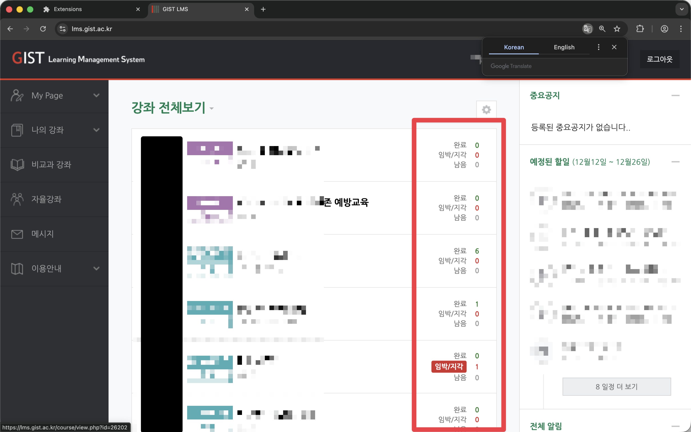
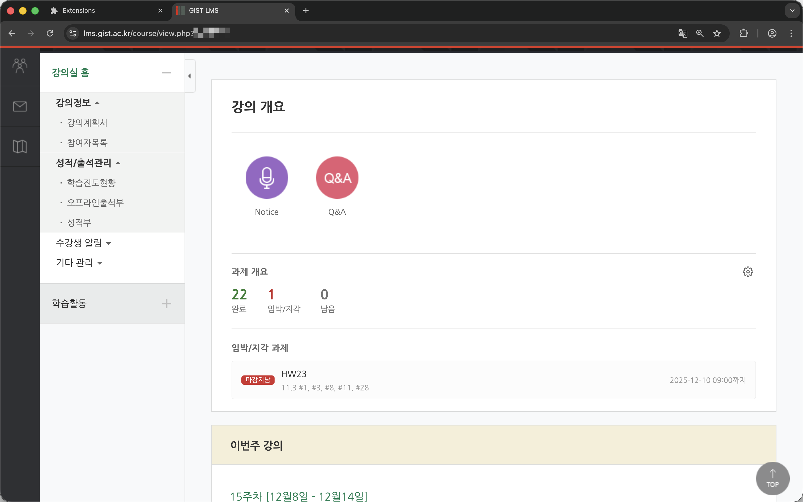
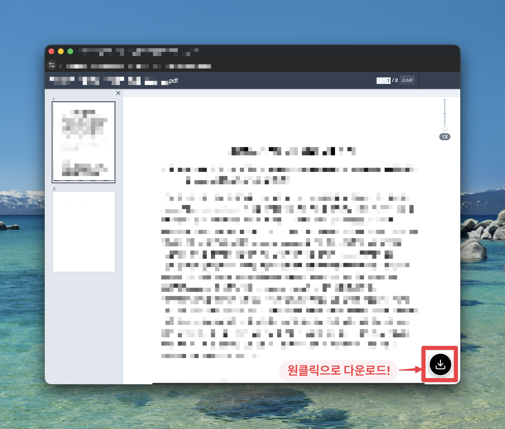

# CSMS+ Extension

GIST LMS(Coursemos)의 사용자 경험을 향상시키는 Chrome/Edge 확장 프로그램입니다.

## 설치
- [Chrome Web Store](https://chromewebstore.google.com/detail/kbdhldgmmjdbobdhjjipmnofnaeahdeh)에서 다운로드
- 혹은 우측 [Releases](https://github.com/enc2586/csmsplus/releases)에서 다운로드

## 주요 기능

### 1. 과제 통계 및 대시보드 (Assignment Tracker)
- **LMS 메인 페이지**: 각 강의별 과제 현황(완료/미완료)을 직관적인 통계 박스로 표시합니다.
  
- **강의 페이지**: 상단 대시보드를 통해 해당 강의의 남은 과제, 지각/임박 과제 등을 한눈에 확인할 수 있습니다.
  
- **과제 상태 표시**: 제출 여부, 마감 임박 등을 시각적으로 명확하게 구분합니다.

### 2. PDF 다운로드 (PDF Downloader)
- **자동 감지**: LMS 내 문서 뷰어 페이지를 자동으로 감지합니다.
- **PDF 변환**: 이미지 기반의 교재를 PDF 파일로 변환하여 다운로드할 수 있습니다.
- **원클릭 다운로드**: 우측 하단 플로팅 버튼을 통해 손쉽게 저장할 수 있습니다.
  

## 설치 및 개발 방법

### 개발 환경 설정
이 프로젝트는 기능별로 모듈화된 구조를 가지고 있습니다.

```bash
# 레포지토리 클론
git clone [repository-url]

# 의존성 설치 (필요시)
# 현재는 바닐라 JS 기반으로 별도 npm install이 필요 없습니다.
```

### 빌드 및 로드

1. **빌드 스크립트 실행**:
   프로젝트 루트에서 배포용 zip 파일을 생성합니다.
   ```bash
   ./build.sh
   ```
   `dist/` 폴더에 `csmsplus-vX.X.X.zip` 파일이 생성됩니다.

2. **확장 프로그램 로드 (개발자 모드)**:
   - Chrome 주소창에 `chrome://extensions` 입력
   - 우측 상단 **"개발자 모드"** 활성화
   - **"압축해제된 확장 프로그램을 로드합니다"** 클릭
   - 프로젝트 루트 폴더 선택

## 프로젝트 구조

```
/
├── assets/                 # 아이콘 및 정적 리소스
├── src/
│   ├── features/
│   │   ├── assignment-tracker/ # 과제 추적 및 대시보드 기능
│   │   └── pdf-downloader/     # PDF 다운로드 기능
│   ├── background/             # 백그라운드 서비스 워커
│   └── shared/                 # 공용 유틸리티 (예정)
└── manifest.json
```

## 라이선스

[](https://creativecommons.org/licenses/by-nc-sa/4.0/)

이 프로젝트는 **Creative Commons Attribution-NonCommercial-ShareAlike 4.0 International License**를 따릅니다.
비영리 목적으로만 사용 가능하며, 수정 배포 시 동일한 라이선스를 적용해야 합니다.
