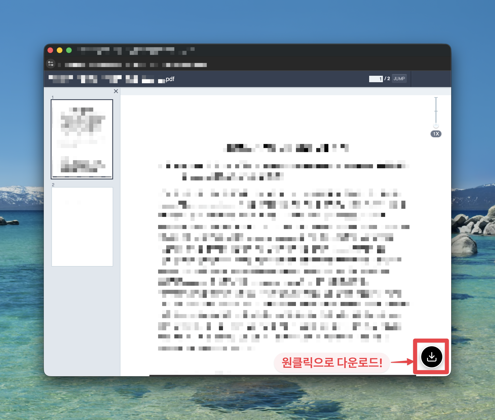

# CSMS+ Extension

GIST LMS(Coursemos)의 사용자 경험을 향상시키는 Chrome/Edge 확장 프로그램입니다.

현재 개발 버전은 **2.1.3**입니다. 업데이트 내역은 확장 프로그램 설정의 패치 노트 탭 또는 [업데이트 로그](src/options/patch_notes.json)에서 확인할 수 있습니다.

## 설치
- [Chrome Web Store](https://chromewebstore.google.com/detail/oekalaanipfieieiibilhfjcoebfaabc)에서 다운로드
- 혹은 우측 [Releases](https://github.com/enc2586/csmsplus/releases)에서 다운로드

## 주요 기능

### 1. 과제 통계 및 대시보드 (Assignment Tracker)
- **LMS 메인 페이지**: 각 강의의 과제를 완료, 마감 임박, 마감 지남, 남음으로 구분해 표시합니다.
- **강의 페이지**: 상단 대시보드에서 완료, 마감 임박, 마감 지남, 남음 과제를 구분하고 임박·마감 지남 목록을 따로 확인할 수 있습니다.
- **추적 제외**: 주차 목록에서는 과제명 오른쪽, 강의 개요에서는 과제명 아래의 버튼으로 집계와 요약 목록에서 제외하거나 다시 추적할 수 있습니다. 제외한 과제에는 회색 칩을 표시합니다. 상세 정보 표시를 꺼도 버튼과 제외 칩은 유지됩니다.
- **선택 유지**: 제외 선택은 해당 브라우저 프로필에 저장되며 새로고침, 브라우저 재시작, 캐시 삭제 후에도 유지됩니다. 다른 기기에 동기화되지 않으며, 제외한 과제의 정보 조회는 계속됩니다.
- **과제 상태 표시**: 개별 과제와 요약 화면 모두 설정한 마감 임박 기준을 사용합니다. 온라인 제출이 필요 없는 과제는 기한이 지나면 기존처럼 완료로 처리합니다.

### 2. PDF 다운로드 (PDF Downloader)
- **자동 감지**: LMS 내 문서 뷰어 페이지를 자동으로 감지합니다.
- **PDF 변환**: 이미지 기반의 교재를 PDF 파일로 변환하여 다운로드할 수 있습니다.
- **원클릭 다운로드**: 우측 하단 플로팅 버튼을 통해 손쉽게 저장할 수 있습니다.
  

## 설치 및 개발 방법

### 개발 환경 설정
[Vite+](https://viteplus.dev)(`vp`)와 pnpm으로 빌드합니다. Node.js 24 이상이 필요합니다.

```bash
git clone https://github.com/enc2586/csmsplus
cd csmsplus
pnpm install
```

### 개발 버전 로드

1. `pnpm build`로 `dist/`를 만듭니다. 코드를 고치는 동안에는 `pnpm dev`를 띄워 두면 바뀔 때마다 `dist/`가 다시 만들어집니다.
2. Chrome에서 `chrome://extensions`를 엽니다. Edge에서는 `edge://extensions`를 사용합니다.
3. 기존 설치 버전이 있으면 비활성화하고 **개발자 모드**를 켭니다.
4. **압축해제된 확장 프로그램을 로드합니다**를 눌러 `dist/` 폴더를 선택합니다.
5. LMS 페이지를 새로고침합니다.

### 검사

```bash
pnpm check   # 포맷, 린트, 타입 검사
node tests/tracker-check.cjs   # 기존 기능 회귀 검사
```

브라우저에서 [레이아웃 검사 페이지](tests/tracker-layout.html)를 열면 실제 표시 스크립트로 좁은 개요 카드의 줄바꿈·가운데 정렬과 주차 버튼 위치를 검사합니다. 버튼을 눌러 추적 상태를 바꾼 뒤에도 `PASS`가 유지되는지 확인합니다.

### 배포용 ZIP 생성

```bash
pnpm release
```

`release/csmsplus-v<버전>.zip`이 생성됩니다.

## 프로젝트 구조

```
/
├── assets/
│   └── icons/                          # 확장 프로그램 아이콘
├── demo/                               # 기능 예시 이미지
├── src/
│   ├── features/
│   │   ├── assignment-tracker/
│   │   │   ├── content-scripts/
│   │   │   │   ├── tracker-main.js              # 강의 페이지 초기화 및 추적 버튼
│   │   │   │   ├── tracker-config.js            # 조회·캐시 기본 설정
│   │   │   │   ├── tracker-utils.js             # 상태 판정·추적 제외·조회 큐
│   │   │   │   ├── tracker-api.js               # 과제 상세 정보 조회
│   │   │   │   ├── tracker-ui.js                # 개별 과제 상태 표시
│   │   │   │   ├── tracker-dashboard.js         # 강의 상단 과제 요약
│   │   │   │   ├── course-list-parser.js        # LMS 메인 강좌 카드 집계
│   │   │   │   └── assignment-cache-updater.js  # 과제 방문 시 캐시 갱신
│   │   │   └── styles/
│   │   │       ├── assignment-styles.css
│   │   │       └── course-stats-styles.css
│   │   └── pdf-downloader/
│   │       ├── content.js                       # PDF 다운로드 UI 및 변환
│   │       ├── pdf-lib-global.js                # PDF 라이브러리를 전역으로 노출
│   │       ├── pdf-lib.min.js                   # 번들된 PDF 라이브러리
│   │       └── styles.css
│   ├── background/
│   │   └── background.js                       # 다운로드 처리 및 설정 화면 열기
│   └── options/
│       ├── options.html
│       ├── options.css
│       ├── options.js                           # 설정 읽기·검증·저장
│       └── patch_notes.json                     # 업데이트 로그
├── tests/
│   ├── tracker-check.cjs                        # 기능 회귀 검사
│   └── tracker-layout.html                      # 브라우저 레이아웃 검사
├── scripts/zip-release.ts                      # 배포용 ZIP 생성
├── manifest.config.ts                          # 권한 및 페이지별 스크립트 등록
├── vite.config.ts                              # Vite+ 빌드·포맷·린트 설정
├── README.md
└── LICENSE
```

## 라이선스

[](https://creativecommons.org/licenses/by-nc-sa/4.0/)

이 프로젝트는 **Creative Commons Attribution-NonCommercial-ShareAlike 4.0 International License**를 따릅니다.
비영리 목적으로만 사용 가능하며, 수정 배포 시 동일한 라이선스를 적용해야 합니다.
